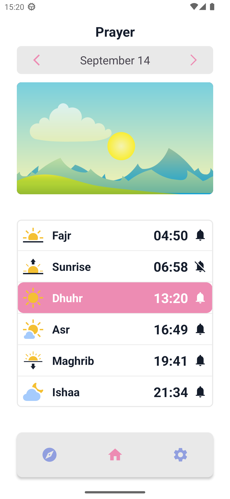
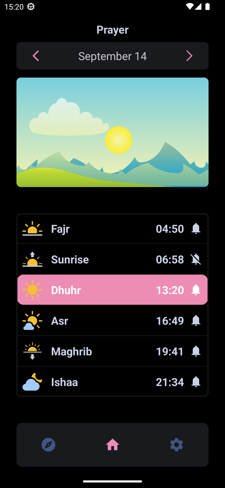

# Athan-Time

 
 

## Current Features:
* Accurate prayer times
* no internet connection needed to calculate prayer times
* no ads
* privacy oriented (open source and we dont share your data with third parties)
* accurate qiblah direction (coming soon)

### Supported Platforms

- Android 5.0+
